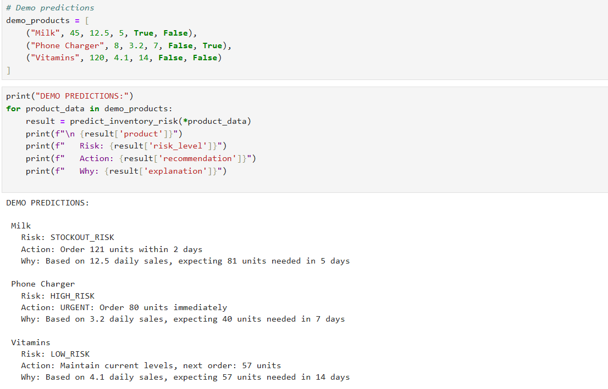

```python
# Demo predictions
demo_products = [
    ("Milk", 45, 12.5, 5, True, False),
    ("Phone Charger", 8, 3.2, 7, False, True),
    ("Vitamins", 120, 4.1, 14, False, False)
]

print("DEMO PREDICTIONS:")
for product_data in demo_products:
    result = predict_inventory_risk(*product_data)
    print(f"\n {result['product']}")
    print(f"   Risk: {result['risk_level']}")
    print(f"   Action: {result['recommendation']}")
    print(f"   Why: {result['explanation']}")

```

